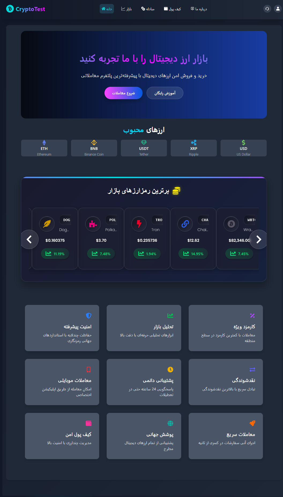

# 🚀 Crypto Project - Cryptok

**Crypto** is a modern online platform for viewing and analyzing cryptocurrency prices in real-time.  
This project is designed with a focus on simplicity, elegance, and providing a seamless user experience.

---

## ✨ Features

- 📈 View real-time cryptocurrency prices
- 📊 Analyze live price charts
- 🎨 Beautiful and user-friendly interface
- 🔌 Fetch data from live API sources

---

## 🌐 Website Pages

- 🏠 **Home Page:** Clean UI with a global market overview
- 📉 **Market Section:** Live list of global cryptocurrencies
- 💱 **Exchange Tool:** Convert digital currencies in real-time
- 💼 **Wallet Section:** Track user transactions and activity
- 👤 **Profile Page:** View and update personal info, registration date, and upload profile picture
- ℹ️ **About Us:** Learn about the team and project vision
- 🛟 **Support Center:** Ticket system and contact info
- ❓ **FAQ Section:** Quick answers to common questions
- 📲 **Contact Us:** Links to Telegram and Instagram for direct communication
- ▶️ **YouTube Demo:** Watch a full video walkthrough
- 🔄 **Updates Section:** Track new features and changes

---

## ⚙️ Installation and Setup

Follow these steps to set up the project locally:

```bash
# Clone the repository
git clone https://github.com/MattinHasanpour//Crypto-App.git

# Go to the project directory
cd Crypto-App

# Install dependencies
npm install

# Start the development server
npm run dev
```

---

## 🤝 Contributing

We welcome contributions! If you'd like to help improve the project:

1. Fork the repository
2. Create a new feature branch
3. Submit a pull request

Also, feel free to open issues for bugs or suggestions.

---

## 📸 Profile Picture Upload

Users can upload their profile picture via this input:

```html
<input type="file" class="profile-upload" accept="image/*" />
```



---

## 📱 Contact Us

Get in touch directly via:

- 📸 [Instagram - @matinhasanpour\_](https://www.instagram.com/matinhasanpour_)
- 💬 [Telegram - @mattinhasanpour](https://t.me/mattinhasanpour)

---

## ▶️ Project Demo

Watch a full walkthrough of the project on YouTube:

[📽️ Watch the Video](https://youtu.be/OXpj6AGiOjY)

---

## 🔄 Updates Section

Latest improvements to the project:

- ✨ **Update 1:** Added new feature to the Exchange Section
- ⚡ **Update 2:** Optimized performance for smoother experience

---

## 🧠 About the Project

Cryptok is not just a cryptocurrency tracking tool — it's designed to provide users with a **reliable, simple, and visually appealing experience** in the world of crypto.

We focus on:

- **Minimal Design:** Clean layout with soft color gradients for a stress-free user experience
- **Live Accuracy:** Real-time data from trusted APIs like CoinGecko and Binance
- **User Trust:** Secure profile management with editable information and personal touches
- **Real Support:** Direct contact via social platforms and built-in ticket system

Every part of Cryptok is crafted with attention to detail, combining functionality and trust to deliver a truly premium crypto experience.
